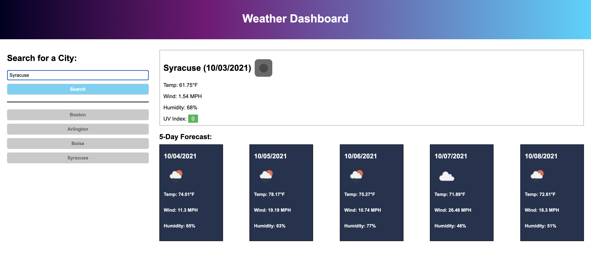

# Weather Dashboard
# Purpose
This web application was built to provide users with a quick responding search-and-display site for looking up the weather based on an entered city name. The OpenWeather API is used to grab the weather data based on what the user searches. The Fetch API is used in conjunction with the OpenWeather API so the application pulls realistic and accurate data.

## How It Was Made
JavaScript, the Fetch API, and the OpenWeather API were the main tools used in the production of this application. The Fetch API allows us to pull the information from the OpenWeather API and then, using plain JavaScript, dynamically display that information in a readable and stylish manner for the user. LocalStorage was also utilized in order to save the searches a user makes and keep them on page reload. 

Link to site: https://chaldrich24.github.io/weather-dashboard/

